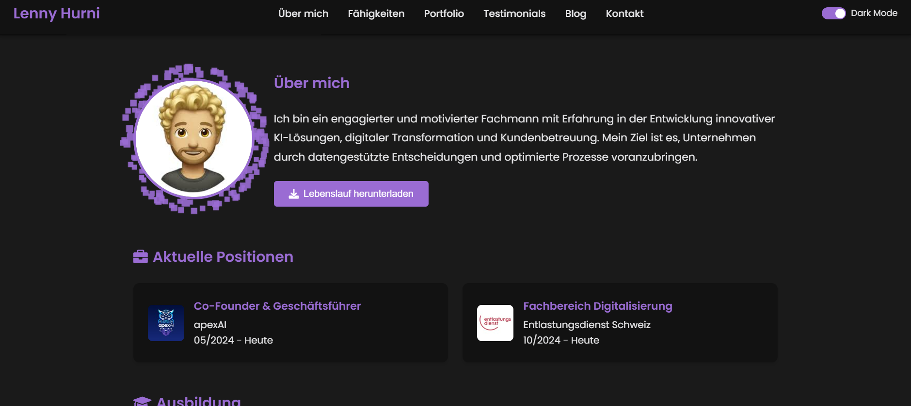

# Portfolio Website - Lenny Hurni

A modern, responsive portfolio website built with Vue.js featuring dark mode, interactive components, and dynamic content loading.

## 🌟 Features

- **Responsive Design**: Fully responsive layout that works on all devices
- **Dark/Light Theme**: Dynamic theme switching with local storage persistence
- **Interactive Components**:
  - 3D Animated Background
  - Skills Visualization
  - Project Showcase
  - Blog Posts with Markdown Support
  - Testimonials Carousel
  - Weather Widget
  - Interactive Map
  - Contact Form

## 🚀 Technologies

- Vue.js 3
- Three.js for 3D animations
- Leaflet.js for maps
- Markdown parsing
- OpenWeatherMap API
- GitHub API

## 📦 Installation

1. Clone the repository from GitHub: lennyhurni/Portfolioseite and navigate to the project directory.

2. Install all required dependencies using npm.

3. Set up environment variables by creating a .env file in the root directory with your API keys for weather and GitHub services.

## 🔧 Development

Launch the development server using npm run serve to start working on the project.

## 🏗️ Building for Production

Create a production build using npm run build and deploy using npm run deploy.

## 🎨 Customization

### Themes
Customize the appearance by modifying theme variables in the global CSS file.

### Content
Update personal information in the following Vue components:
- AboutMe
- ProjectList
- BlogPosts
- TestimonialsCarousel

## 📱 Project Structure

The project is organized into components and services:
- Components for UI elements
- Services for API integration
- Main App file
- Asset management

## 🤝 Contributing

Contribute to the project by:
1. Forking the repository
2. Creating a feature branch
3. Making changes
4. Submitting a pull request

## 📄 License

MIT License

## 👤 Author

**Lenny Hurni**
- LinkedIn: [Lenny Hurni](https://linkedin.com/in/lenny-hurni)
- GitHub: [@lennyhurni](https://github.com/lennyhurni)

## 🙏 Acknowledgments

- Vue.js Team
- Three.js Community
- OpenWeatherMap API
- All Open Source Contributors